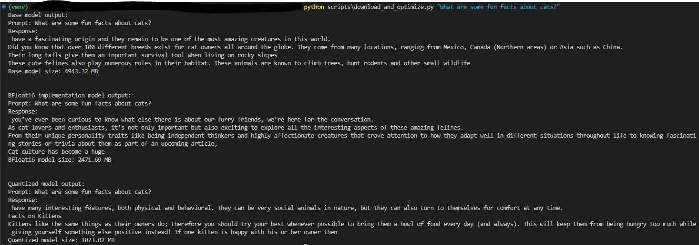
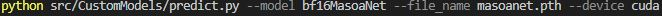
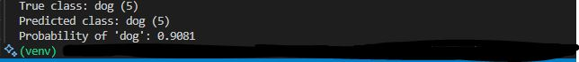
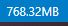
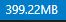
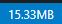

# Fine-Tuning Pretrained LLMs

This repository demonstrates a variety of memory optimization techniques for fine-tuning large language models (LLMs) that I implemented from scratch. Specifically the following research papers:
1. Mixed Precision Training (BFloat16):
- https://arxiv.org/abs/1710.03740
2. LoRA: Low-Rank Adaptation of Large Language Models:
- https://arxiv.org/abs/2106.09685
3. Model Quantization:
- https://arxiv.org/abs/2110.02861
- https://arxiv.org/abs/2212.09720
4. QLoRA (Quantized Low-Rank Adapters):
- https://arxiv.org/abs/2305.14314

. It includes small custom models for experimentation and utilities for downloading, transforming and measuring models from the Hugging Face Hub. In my use case I used the LLama-3.2-1B Model that can be found [here](https://huggingface.co/meta-llama/Llama-3.2-1B): 

## Repository layout

- `src/CustomModels/` – Custom implemented neural network examples and their optimized variants
  - `MasoaNet.py` – baseline custom model (name variation)
  - `bf16MasoaNet.py` – uses bfloat16 layers
  - `loraMasoaNet.py` – LoRA enabled model
  - `qloraMasoaNet.py` – QLoRA enabled model
  - `quantMasoaNet.py` – 4‑bit weight quantization
  - `memorystats.py` – utilities for measuring parameter counts and memory usage to compare base model against optimized versions
  - `train.py` – script to train any of the above models on random data or CIFAR‑10
- `src/Fine_Tuning/` – reusable utilities
  - `model_utils.py` – helpers for downloading HF models and generating text
  - `optimizations/` – lightweight implementations of BFloat16, LoRA, QLoRA and quantization layers
- `scripts/`
  - `download_and_optimize.py` – example workflow that downloads a model from the HuggingFace Hub, applies optimizations and compares outputs
- `tests/` – unit tests covering the optimization layers and .py files associated

## Quick start

Install the required packages. The provided `requirements.txt` targets CUDA 11.8 wheels but can be replaced with CPU‑only builds if needed or if GPU is not accessible:

```bash
pip install -r requirements.txt
pip install -r requirements-dev.txt  # for running tests
```

### Training a model

The `train.py` script trains the selected head model as a binary classifier. For example, to train the LoRA variant on the CIFAR‑10 cat vs. dog subset:

```bash
python src/CustomModels/train.py --dataset cifar \
    --model loraMasoaNet --epochs 10 --lr 1e-3
```

Checkpoints are written to `checkpoints/` by default but can be moved somewhere else. The files I created were too big to add to the repository but I had them named:
- `loraMasoaNet.pth`
- `masoanet.pth`
- `qloraMasoaNet.pth`

### Comparing optimizations

`download_and_optimize.py` downloads a model from the Hugging Face Hub and shows the effect of bfloat16 conversion and 4‑bit quantization:

```bash
python scripts/download_and_optimize.py "Hello world" --impl reference
```

### Memory statistics

To print parameter counts and memory usage for several models:

```bash
python -m CustomModels.memorystats MasoaNet loraMasoaNet quantMasoaNet
```

## Tests

Unit tests validate the optimization layers. After installing the dev requirements, run:

```bash
pytest
```

## Example outputs

Custom Models that were trained locally and their respective sizes:

Example output running LLama-3.2-1B in cmd line with sample input for text generation from decoder section:



Example output for model inference on BFloat16 custom model:

sample cmd line run:

cmd line output:

image for prediction:


Sample model sizes (too big to upload here):

Original Model Size:


LoRA Model Size:


QLoRA Model Size:



## License

This project is licensed under the MIT License.

# End of Document